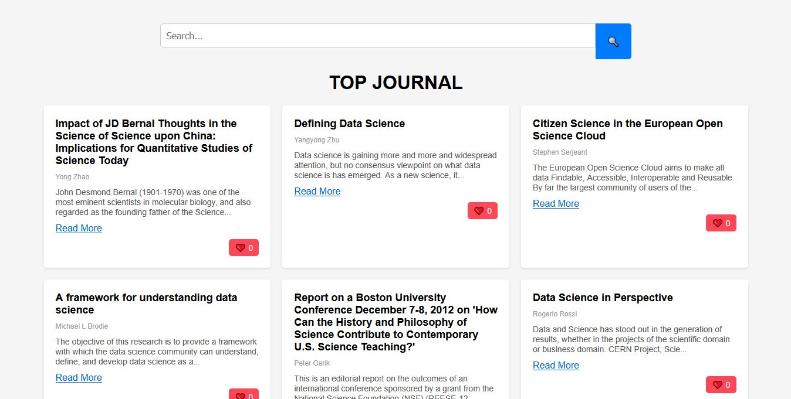

# 📜 mnzproject

mnzproject adalah sebuah platform berbasis web yang memungkinkan pengguna untuk melakukan scrolling jurnal penelitian ilmiah seperti halnya TikTok. Algoritma rekomendasi akan menyesuaikan jurnal yang muncul berdasarkan preferensi pengguna (jurnal yang dilike dan disimpan).

## ✨ Fitur Utama
- 🔍 **Rekomendasi Jurnal** - Jurnal yang ditampilkan akan sesuai dengan minat pengguna.
- 🎯 **Interaksi Pengguna** - Pengguna dapat like, save, dan share jurnal.
- 📜 **Infinite Scrolling** - Navigasi yang smooth untuk eksplorasi tanpa batas.
- 🏷 **Kategori & Tag** - Pengguna dapat mencari jurnal berdasarkan kategori atau tag tertentu.
- 📊 **Analitik Pengguna** - Melihat tren jurnal populer dan rekomendasi yang lebih personal.

## 🛠 Teknologi yang Digunakan
- **Frontend:** React
- **Backend:** Node.js
- **Database:** Supabase

## 🚀 Cara Menjalankan Proyek

1. Clone repository ini:
   ```sh
   git clone https://github.com/username/mnzproject.git
   ```
2. Masuk ke direktori proyek:
   ```sh
   cd mnzproject
   ```
3. Install dependencies:
   ```sh
   npm install
   ```
4. Jalankan server pengembangan:
   ```sh
   npm run dev
   ```

## 🤝 Kontribusi
Proyek ini bersifat open-source, dan kontribusi dari siapapun sangat diharapkan!

### Cara Berkontribusi:
1. Fork repository ini.
2. Buat branch baru untuk fitur/perbaikan yang ingin Anda tambahkan.
3. Lakukan perubahan dan commit dengan pesan yang jelas.
4. Kirimkan pull request dan tunggu review.

## 📌 Roadmap
# 🚀 Roadmap Lanjutan untuk mnzproject

## ✅ 1. Sistem Rekomendasi Berdasarkan Like & Save

⏩ *Mirip algoritma TikTok, konten muncul sesuai interaksi pengguna.*

- [ ] Tambah fitur **"Save"** (selain "Like")
  - Simpan ke localStorage dulu (nantinya bisa ke database)
- [ ] Buat halaman **Saved Articles**
- [ ] Tampilkan **rekomendasi berdasarkan topik** yang paling banyak disukai/disimpan

---

## 🎨 2. UI/UX Polesan & Interaktivitas

🔁 *Biar lebih engaging, fun, dan TikTok-vibe*

- [ ] Animasi saat scroll / loading konten baru
- [ ] Infinite scroll lebih mulus + loading skeleton (shimmer)
- [ ] Tambahkan **badge**: `"Trending"`, `"New"`, atau `"Saved"`
- [ ] Gunakan **gambar header** untuk tiap artikel (default placeholder dulu)

---

## 🧠 3. Analisis Minat Pengguna (Simple AI Layer)

🤖 *Awal dari intelligence di mnzproject*

- [ ] Track interaksi per topik keyword (like, save)
- [ ] Buat model sederhana (berbasis frekuensi) untuk:
  - Menampilkan topik yang paling sering di-*like*
  - Menampilkan **"You might like..."** section

---

## 🔐 4. Autentikasi User *(Opsional jika ingin multi-user)*

✉️ *Agar like/save bisa tersimpan per user dan digunakan untuk rekomendasi*

- [ ] Login dengan Google (pakai Firebase Auth)
- [ ] Simpan data like/save ke Firestore atau Supabase
- [ ] Fetch data berdasarkan user ID

---

## 🛠️ 5. Admin Panel / CMS Mini

🧪 *Untuk memoderasi artikel yang tampil (jika perlu)*

- [ ] Panel sederhana buat nyaring artikel
- [ ] Mark sebagai **featured/trending**

---

## 🔄 Urutan yang Disarankan Selanjutnya:

1. Fitur **Save + halaman Saved Articles**
2. Rekomendasi berdasarkan **Like & Save**
3. UI animasi + polish
4. *(Opsional)* Login & penyimpanan per user


## 📄 Lisensi
Proyek ini menggunakan lisensi **MIT** - Silakan lihat file `LICENSE` untuk detail lebih lanjut.

---

🚀 Mari bersama membangun platform edukasi yang lebih interaktif! Jika tertarik untuk berkontribusi atau memiliki ide lain, jangan ragu untuk bergabung! 😊
